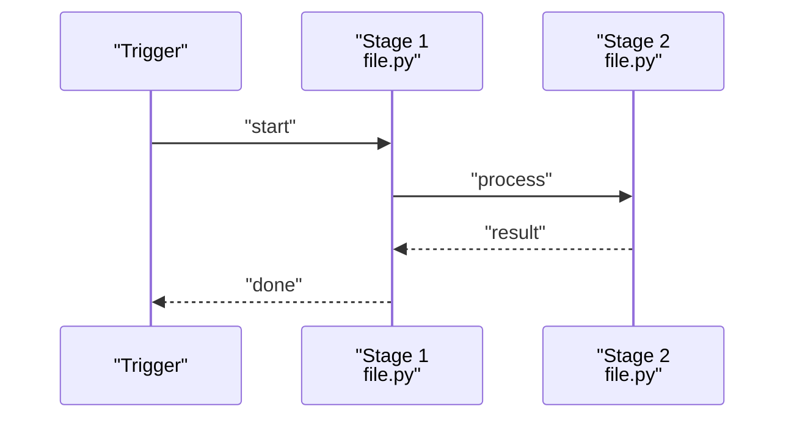
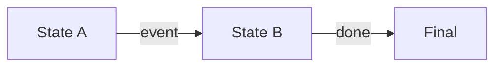

# {{TITLE}}

## Contents
1. [Introduction](#introduction)
2. [Flow Overview](#flow-overview)
3. [Key Steps](#key-steps)
4. [Involved Components](#involved-components)
5. [Data and State Changes](#data-and-state-changes)
6. [Troubleshooting Guide](#troubleshooting-guide)
7. [Conclusion](#conclusion)

## Introduction
<One paragraph: what this flow is, what triggers it, where it ends, and where it lives in the repository.>

## Flow Overview
<One paragraph sketching the end-to-end path (entry → key stages → exit), with a sequence diagram; for a heavily branched flow, a graph TB branch diagram may accompany the sequence diagram.>

Diagram sources
- [<path>:<from>-<to>](file://<path>#L<from>-L<to>)

Section sources
- [<path>:<from>-<to>](file://<path>#L<from>-L<to>)

## Key Steps
<Step numbers correspond one-to-one with participants in the Flow Overview sequence diagram.>
### Step 1: <name>
- Input: <what enters this step>
- Handling: <what happens, with a file:// citation to the key code>
- Concurrency and retries: <this step's concurrency semantics / retries / idempotency; omit if none>
- Failure path: <how failures surface and are handled>

Section sources
- [<path>:<from>-<to>](file://<path>#L<from>-L<to>)

### Step 2: <name>
- ...

**Section sources**
- [<path>:<from>-<to>](file://<path>#L<from>-L<to>)

## Involved Components
One sentence of prose on how the components collaborate, then bullets in call order: - <component/module>: its role in this flow.

Section sources
- [<path>:<from>-<to>](file://<path>#L<from>-L<to>)

## Data and State Changes
<Before/after comparison of data and state: inputs/outputs, side effects, state-machine transitions; prefer stateDiagram-v2 for a real state machine, and a flow diagram for simple transitions.>

Diagram sources
- [<path>:<from>-<to>](file://<path>#L<from>-L<to>)

Section sources
- [<path>:<from>-<to>](file://<path>#L<from>-L<to>)

## Troubleshooting Guide
- One sentence of prose on the troubleshooting approach, then at least 3 scenarios as bullets: symptom → cause → how to locate → relevant code location.

Section sources
- [<path>:<from>-<to>](file://<path>#L<from>-L<to>)

## Conclusion
<One paragraph: when this flow applies, correct usage, and caveats.>

Section sources
- [<path>:<from>-<to>](file://<path>#L<from>-L<to>)

<cite>
**Files referenced**
- [<file name>](file://<repo-relative path>)
- [<file name>](file://<repo-relative path>)
</cite>
