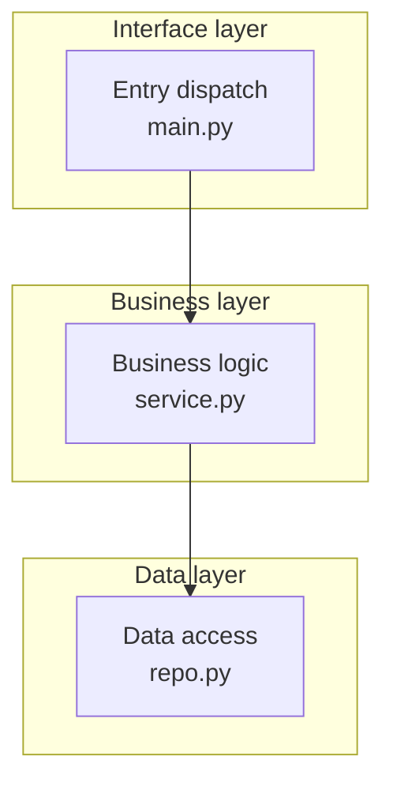
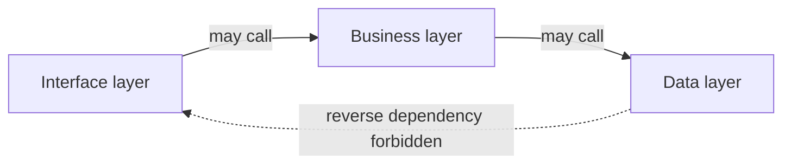
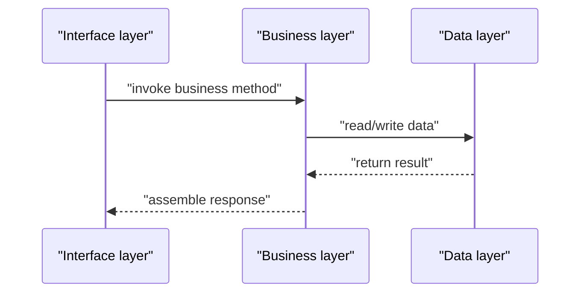

# {{TITLE}}

## Contents
1. [Introduction](#introduction)
2. [Layer Overview](#layer-overview)
3. [Layer Responsibilities](#layer-responsibilities)
4. [Layer Dependencies and Call Rules](#layer-dependencies-and-call-rules)
5. [Vertical Slice: One Call Through the Layers](#vertical-slice-one-call-through-the-layers)
6. [Cross-Cutting Concerns](#cross-cutting-concerns)
7. [Troubleshooting Guide](#troubleshooting-guide)
8. [Conclusion](#conclusion)

## Introduction
<One paragraph: what this layered architecture is, the principle behind the layering, and where it lives in the repository.>

## Layer Overview
<One paragraph sketching how many layers there are and each layer's one-line role, with a vertically stacked layer diagram (top layer on top, representative components per layer).>

Diagram sources
- [<path>:<from>-<to>](file://<path>#L<from>-L<to>)

Section sources
- [<path>:<from>-<to>](file://<path>#L<from>-L<to>)

## Layer Responsibilities
### <Layer 1>
- Responsibility: <what this layer does>
- Representative modules: <key files/classes>
- Must not do: <layer violations, e.g. bypassing the business layer to touch the data layer>

Section sources
- [<path>:<from>-<to>](file://<path>#L<from>-L<to>)

### <Layer 2>
- ...

Section sources
- [<path>:<from>-<to>](file://<path>#L<from>-L<to>)

## Layer Dependencies and Call Rules
<One paragraph: who may call whom, which dependency directions are forbidden, and how violations surface. With a dependency-direction diagram.>

Diagram sources
- [<path>:<from>-<to>](file://<path>#L<from>-L<to>)

Section sources
- [<path>:<from>-<to>](file://<path>#L<from>-L<to>)

## Vertical Slice: One Call Through the Layers
<Pick one representative call path and show with a sequence diagram how it crosses from the interface layer down to the data layer and back.>

Diagram sources
- [<path>:<from>-<to>](file://<path>#L<from>-L<to>)

Section sources
- [<path>:<from>-<to>](file://<path>#L<from>-L<to>)

## Cross-Cutting Concerns
First a short prose paragraph on where cross-cutting mechanisms land overall, then bullets: mechanism → which layers → key code locations.

Section sources
- [<path>:<from>-<to>](file://<path>#L<from>-L<to>)

## Troubleshooting Guide
- <common error/symptom → cause → how to locate → relevant code location (e.g. how to trace a suspected layer violation).>

Section sources
- [<path>:<from>-<to>](file://<path>#L<from>-L<to>)

## Conclusion
<One paragraph: the layering rationale, correct usage, and caveats.>

Section sources
- [<path>:<from>-<to>](file://<path>#L<from>-L<to>)

<cite>
**Files referenced**
- [<file name>](file://<repo-relative path>)
- [<file name>](file://<repo-relative path>)
</cite>
