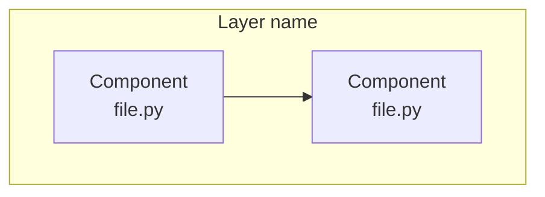
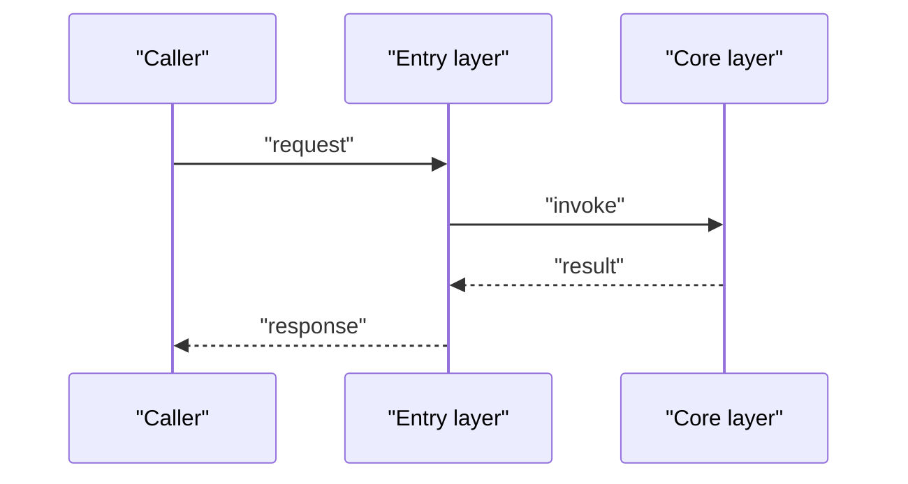
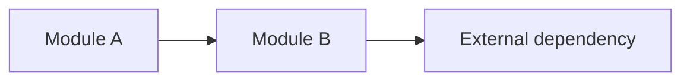

# {{TITLE}}

## Contents
1. [Introduction](#introduction)
2. [Project Structure](#project-structure)
3. [Core Components](#core-components)
4. [Architecture Overview](#architecture-overview)
5. [Detailed Component Analysis](#detailed-component-analysis)
6. [Dependency Analysis](#dependency-analysis)
7. [Performance and Consistency Considerations](#performance-and-consistency-considerations)
8. [Troubleshooting Guide](#troubleshooting-guide)
9. [Conclusion](#conclusion)

## Introduction
<One paragraph: what this page's topic is, what problem it solves, where it lives; may quote the README/official docs verbatim for positioning (file:// citation) plus 2~4 key-characteristic bullets (language/scale/form).>

## Project Structure
<Repository directories/files relevant to this chapter: lead with a fenced plain-text directory tree, then bullets explaining key directories.>

Diagram sources
- [<path>:<start>-<end>](file://<path>#L<start>-L<end>)

Section sources
- [<path>:<start>-<end>](file://<path>#L<start>-L<end>)

## Core Components
<With ≥4 components prefer a table (| Component | Key files | Responsibility |) with a one-line reading hint; otherwise bullets.>
- <component/concept name>: <one-sentence responsibility>
- Extension points: <where it can be customized / plugged into; omit if none>

Section sources
- [<path>:<start>-<end>](file://<path>#L<start>-L<end>)

## Architecture Overview
<One paragraph + a sequence diagram describing the runtime interaction or data flow of this topic; when type/inheritance relations matter, a classDiagram may accompany the sequence diagram.>

Diagram sources
- [<path>:<start>-<end>](file://<path>#L<start>-L<end>)

Section sources
- [<path>:<start>-<end>](file://<path>#L<start>-L<end>)

## Detailed Component Analysis
<Index (chapter) pages: give a navigation table here (| Sub-page | Key entity/mechanism | One-line responsibility |, no links); topic pages expand sub-components one by one.>
### <sub-component / sub-topic 1>
- Responsibility: <...>
- Key behaviors: <...>
- Implementation notes: <...>
- Configuration surface: <relevant config keys / environment variables; omit if none>

Section sources
- [<path>:<start>-<end>](file://<path>#L<start>-L<end>)

### <sub-component / sub-topic 2>
- ...

Section sources
- [<path>:<start>-<end>](file://<path>#L<start>-L<end>)

## Dependency Analysis
- First a short prose paragraph on the overall dependency picture; group dependencies as required / recommended / optional, and with ≥4 entries use a table (| Dependency | Min version | Role |).

Diagram sources
- [<path>:<start>-<end>](file://<path>#L<start>-L<end>)

Section sources
- [<path>:<start>-<end>](file://<path>#L<start>-L<end>)

## Performance and Consistency Considerations
- First a short prose paragraph on overall characteristics and key trade-offs, then bullets for the points (performance / concurrency / caching / consistency).

Section sources
- [<path>:<start>-<end>](file://<path>#L<start>-L<end>)

## Troubleshooting Guide
- One sentence of prose on the troubleshooting approach, then at least 3 scenarios as bullets: symptom → cause → how to locate → relevant code location.

Section sources
- [<path>:<start>-<end>](file://<path>#L<start>-L<end>)

## Conclusion
<One paragraph: the topic's positioning, correct usage, and caveats.>

Section sources
- [<path>:<start>-<end>](file://<path>#L<start>-L<end>)

<cite>
**Files referenced by this page**
- [<file name>](file://<repo-relative path>)
- [<file name>](file://<repo-relative path>)
</cite>
