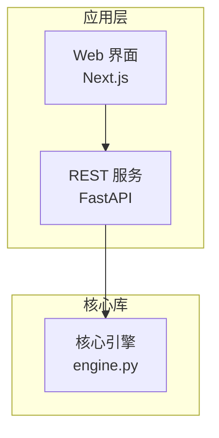
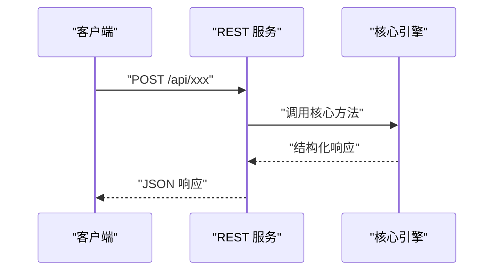

# 文风与图表规范（所有页面必须遵循）

## 语言
- 正文简体中文；技术名词、类名、文件路径、配置键保留英文原文。
- 中文与英文/数字之间留一个空格（如「Python SDK 使用指南」「BM25 关键词搜索算法」）。
- 不使用 emoji。叙事性内容不使用表格；多维属性的枚举清单（如 实体|类型|约束、组件|关键文件|职责、依赖|最低版本|作用、错误码|含义|触发条件）应使用表格呈现，并在表格前用一句话说明怎么读。

## 正文密度（内容质量，强制）
- 每个正文章节先用 2~4 句散文把事情说清楚（是什么、怎么运作、边界在哪），再用 bullet 列举枚举性事实；整节只有一句话或只有一个 bullet 视为不合格。
- 每个 mermaid 图之前用一句话说明画的是什么、为什么值得看；图之后用一句话解读从图中能得出的结论——图不替代文字。
- 只有一条内容的列表必须改写为散文句。每个小节的正文（不含图表与来源列表）不少于约 3 行。
- Grounding 纪律：证据不足的小节如实写薄并使用概念性说明声明，禁止编造文件、行号或行为——宁少勿造。

## 章节来源与图表来源（引用格式，强制）
- 每个正文章节末尾附「章节来源」列表；每个 mermaid 图后附「图表来源」列表。
- 链接格式（路径相对仓库根目录，统一正斜杠，行号区间不得超出文件实际行数；仅终点越界会被自动钳制到文件末尾，起点越界或区间倒置会被 `check` 打回重写）：
  - `[README.md:1-120](file://README.md#L1-L120)`
  - `[graphiti_core/graphiti.py:146-283](file://graphiti_core/graphiti.py#L146-L283)`
- 仅供整文件引用时可用 `[nodes.py](file://graphiti_core/nodes.py)` 形式（`<cite>` 块内）。
- 引用的文件必须是真实存在的仓库文件；禁止引用其他 wiki 页面（页间零链接）。
- 某节确无对应代码时写：`[本节为概念性说明，不直接分析具体文件，故无"章节来源"]`

## mermaid 图表风格
- 结构图用 `graph TB`，依赖/关系图用 `graph LR`，交互流程用 `sequenceDiagram`，类型关系可用 `classDiagram`，实体关系可用 `erDiagram`，状态迁移可用 `stateDiagram-v2`。图表类型应与页面 archetype 匹配（如 data 页优先 `erDiagram`/`stateDiagram-v2`，layer 页优先分层 `graph TB`）。
- 语法注意：`graph`/`flowchart` 的节点标签必须用双引号包裹；`stateDiagram-v2` 的迁移标签写作 `状态A --> 状态B : "触发条件"`，显示名用 `state "名称" as id` 别名；`erDiagram` 的实体名用英文标识符，关系标签放引号内。
- 节点标签必须用双引号包裹，长标签用 ` ` 换行并附英文关键名：

- sequenceDiagram 的 participant 与消息也用引号包裹：

## 页面其他约定
- 一级标题（H1）必须且只能是页面标题；正文层级从 `##` 开始，子组件用 `###`。
- 「目录」小节为数字列表，锚点为 GitHub 风格中文锚点（小写、去标点、空格转 `-`，如 `附录：一键运行清单` → `#附录一键运行清单`）。
- 行文客观陈述，避免营销语气；结论小节给出一句话定位与使用建议。
