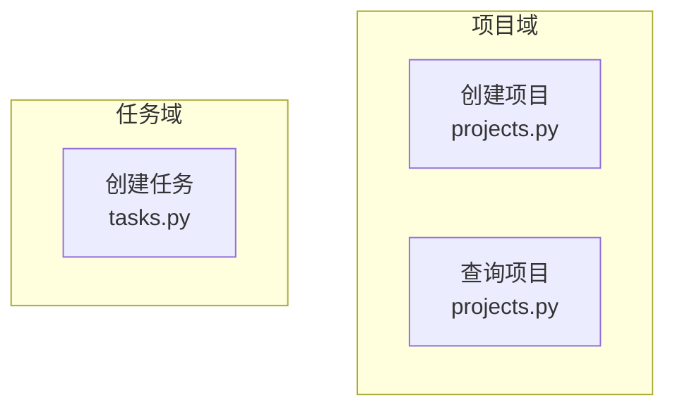
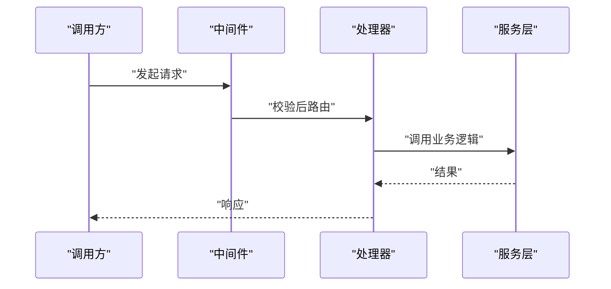

# {{TITLE}}

## 目录
1. [简介](#简介)
2. [接口清单与分组](#接口清单与分组)
3. [请求处理时序](#请求处理时序)
4. [接口契约与错误码](#接口契约与错误码)
5. [鉴权与访问控制](#鉴权与访问控制)
6. [配额、幂等与限流](#配额幂等与限流)
7. [故障排查指南](#故障排查指南)
8. [结论](#结论)

## 简介
<一段话：这组接口面向谁（外部调用方/命令行用户/其他进程）、解决什么问题、在仓库中的位置。>

## 接口清单与分组
<按功能域分组的接口清单（bullet 列表：接口名 → 一句话用途）。配分组结构图。>

图表来源
- [<path>:<起>-<止>](file://<path>#L<起>-L<止>)

章节来源
- [<path>:<起>-<止>](file://<path>#L<起>-L<止>)

## 请求处理时序
<选一条代表性调用：从客户端请求到响应的完整处理路径。>

图表来源
- [<path>:<起>-<止>](file://<path>#L<起>-L<止>)

章节来源
- [<path>:<起>-<止>](file://<path>#L<起>-L<止>)

## 接口契约与错误码
先用一段话概括契约风格；错误码 ≥3 个时用表格（| 错误码 | 含义 | 触发条件 |），并在「接口清单与分组」中为每个接口附 file:// 引用。

章节来源
- [<path>:<起>-<止>](file://<path>#L<起>-L<止>)

## 鉴权与访问控制
<认证方式、权限校验在哪个代码层落地、匿名与授权行为的差异（bullet 列表）；没有鉴权则说明现状与边界。>

章节来源
- [<path>:<起>-<止>](file://<path>#L<起>-L<止>)

## 配额、幂等与限流
<速率限制、幂等键、重试语义等约定（bullet 列表）；没有则说明现状与调用方需自行注意的边界。>

章节来源
- [<path>:<起>-<止>](file://<path>#L<起>-L<止>)

## 故障排查指南
- <常见错误码/现象 → 原因 → 定位步骤 → 相关代码位置。>

章节来源
- [<path>:<起>-<止>](file://<path>#L<起>-L<止>)

## 结论
<一段话总结：接口面的定位、正确使用方式与注意事项。>

章节来源
- [<path>:<起>-<止>](file://<path>#L<起>-L<止>)

<cite>
**本文引用的文件**
- [<文件名>](file://<仓库相对路径>)
- [<文件名>](file://<仓库相对路径>)
</cite>
