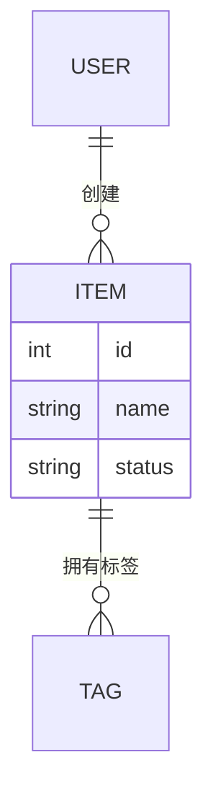
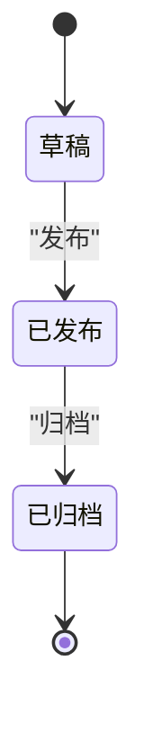

# {{TITLE}}

## 目录
1. [简介](#简介)
2. [数据模型总览](#数据模型总览)
3. [核心实体分析](#核心实体分析)
4. [状态机](#状态机)
5. [存储与序列化](#存储与序列化)
6. [数据生命周期](#数据生命周期)
7. [故障排查指南](#故障排查指南)
8. [结论](#结论)

## 简介
<一段话：本页覆盖哪些数据/实体/状态、为什么重要、在仓库中的位置。>

## 数据模型总览
<一段话概括核心实体及其关系。配实体关系图（实体名用英文，关系标签可用中文）。>

图表来源
- [<path>:<起>-<止>](file://<path>#L<起>-L<止>)

章节来源
- [<path>:<起>-<止>](file://<path>#L<起>-L<止>)

## 核心实体分析
### <实体 1>
- 字段：<关键字段与类型；字段较多时用表格：| 字段 | 类型 | 约束/说明 |>
- 约束：<唯一性/非空/引用完整性等>
- 不变量：<业务上必须始终成立的条件>

章节来源
- [<path>:<起>-<止>](file://<path>#L<起>-L<止>)

### <实体 2>
- ...

章节来源
- [<path>:<起>-<止>](file://<path>#L<起>-L<止>)

## 状态机
<如有状态字段：列出全部状态与迁移触发条件，用 stateDiagram-v2 描述（状态显示名可用 `state "中文名" as id` 别名写法）；没有显式状态机则说明数据状态的隐式流转。>

图表来源
- [<path>:<起>-<止>](file://<path>#L<起>-L<止>)

章节来源
- [<path>:<起>-<止>](file://<path>#L<起>-L<止>)

## 存储与序列化
先用一段话概括存储格局，再逐条列举：存哪里（内存/文件/数据库）、格式、序列化/反序列化代码点。

章节来源
- [<path>:<起>-<止>](file://<path>#L<起>-L<止>)

## 数据生命周期
<从创建、使用/更新到归档/清理的完整路径。配生命周期图。>

图表来源
- [<path>:<起>-<止>](file://<path>#L<起>-L<止>)

章节来源
- [<path>:<起>-<止>](file://<path>#L<起>-L<止>)

## 故障排查指南
- <常见数据问题（不一致/脏数据/并发冲突）→ 原因 → 定位步骤 → 相关代码位置。>

章节来源
- [<path>:<起>-<止>](file://<path>#L<起>-L<止>)

## 结论
<一段话总结：数据模型的定位、正确使用方式与注意事项。>

章节来源
- [<path>:<起>-<止>](file://<path>#L<起>-L<止>)

<cite>
**本文引用的文件**
- [<文件名>](file://<仓库相对路径>)
- [<文件名>](file://<仓库相对路径>)
</cite>
