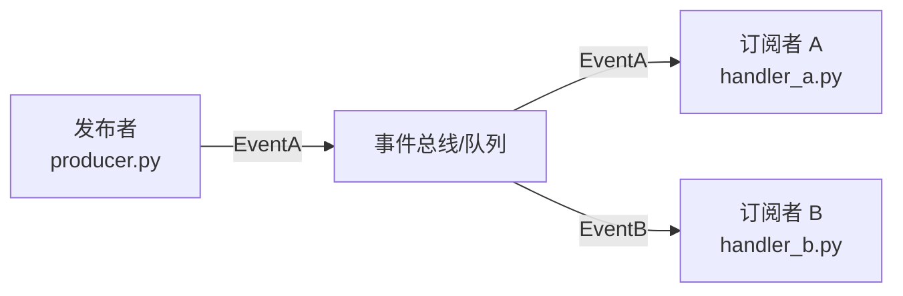
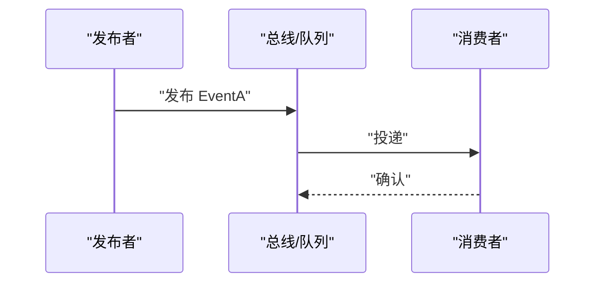

# {{TITLE}}

## 目录
1. [简介](#简介)
2. [事件清单](#事件清单)
3. [事件流拓扑](#事件流拓扑)
4. [事件契约](#事件契约)
5. [消费端处理](#消费端处理)
6. [可靠性保障](#可靠性保障)
7. [故障排查指南](#故障排查指南)
8. [结论](#结论)

## 简介
<一段话：这套事件机制是什么、解决什么问题（解耦/异步/广播）、在仓库中的位置。>

## 事件清单
<事件清单：≥4 个时用表格（| 事件 | 触发点 | 载荷要点 |），少量时用 bullet。>

章节来源
- [<path>:<起>-<止>](file://<path>#L<起>-L<止>)

## 事件流拓扑
<一段话概括事件从发布到消费的整体路径。配拓扑图。>

图表来源
- [<path>:<起>-<止>](file://<path>#L<起>-L<止>)

章节来源
- [<path>:<起>-<止>](file://<path>#L<起>-L<止>)

## 事件契约
<载荷字段、schema 定义位置、版本兼容策略（bullet 列表）。>

章节来源
- [<path>:<起>-<止>](file://<path>#L<起>-L<止>)

## 消费端处理
<选一条代表性事件：从发布到消费完成、确认的时序。>

图表来源
- [<path>:<起>-<止>](file://<path>#L<起>-L<止>)

章节来源
- [<path>:<起>-<止>](file://<path>#L<起>-L<止>)

## 可靠性保障
<重试策略、幂等、死信/失败处理、顺序保证（bullet 列表）；没有则说明现状与风险。>

章节来源
- [<path>:<起>-<止>](file://<path>#L<起>-L<止>)

## 故障排查指南
- <常见问题（事件丢失/重复消费/顺序错乱）→ 原因 → 定位步骤 → 相关代码位置。>

章节来源
- [<path>:<起>-<止>](file://<path>#L<起>-L<止>)

## 结论
<一段话总结：事件机制的定位、正确使用方式与注意事项。>

章节来源
- [<path>:<起>-<止>](file://<path>#L<起>-L<止>)

<cite>
**本文引用的文件**
- [<文件名>](file://<仓库相对路径>)
- [<文件名>](file://<仓库相对路径>)
</cite>
