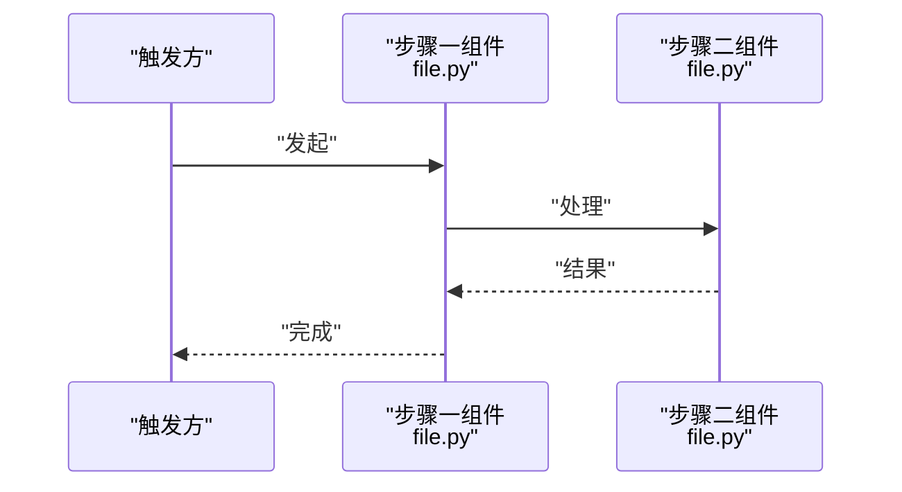

# {{TITLE}}

## 目录
1. [简介](#简介)
2. [流程总览](#流程总览)
3. [关键步骤](#关键步骤)
4. [参与组件](#参与组件)
5. [数据与状态变化](#数据与状态变化)
6. [故障排查指南](#故障排查指南)
7. [结论](#结论)

## 简介
<一段话：这个流程是什么、由什么触发、到什么结束，在仓库中的位置。>

## 流程总览
<一段话概括端到端路径（起点 → 关键环节 → 终点），配时序图；分支复杂的流程可在时序图外补一张 graph TB 分支图。>

图表来源
- [<path>:<起>-<止>](file://<path>#L<起>-L<止>)

章节来源
- [<path>:<起>-<止>](file://<path>#L<起>-L<止>)

## 关键步骤
<以下步骤编号与「流程总览」时序图的参与者一一对应。>
### 步骤 1：<名称>
- 输入：<什么进入这一步>
- 处理：<这一步做什么，附关键代码的 file:// 引用>
- 并发与重试：<该步骤的并发语义/重试/幂等；没有则省略此条>
- 失败路径：<出错时如何表现与处理>

章节来源
- [<path>:<起>-<止>](file://<path>#L<起>-L<止>)

### 步骤 2：<名称>
- ...

**章节来源**
- [<path>:<起>-<止>](file://<path>#L<起>-L<止>)

## 参与组件
先用一句散文说明各组件如何协作，再按调用顺序逐条列出：- <组件/模块名>：承担的职责。

章节来源
- [<path>:<起>-<止>](file://<path>#L<起>-L<止>)

## 数据与状态变化
<流程前后数据/状态的对比：输入输出、副作用、状态机迁移；涉及真实状态机时优先用 stateDiagram-v2 描述，简单状态流转可用流程图。>

图表来源
- [<path>:<起>-<止>](file://<path>#L<起>-L<止>)

章节来源
- [<path>:<起>-<止>](file://<path>#L<起>-L<止>)

## 故障排查指南
- 排查思路先用一句散文概括，再逐条列出至少 3 个场景：现象 → 原因 → 定位步骤 → 相关代码位置。

章节来源
- [<path>:<起>-<止>](file://<path>#L<起>-L<止>)

## 结论
<一段话：流程的适用边界、正确使用方式与注意事项。>

章节来源
- [<path>:<起>-<止>](file://<path>#L<起>-L<止>)

<cite>
**本文引用的文件**
- [<文件名>](file://<仓库相对路径>)
- [<文件名>](file://<仓库相对路径>)
</cite>
