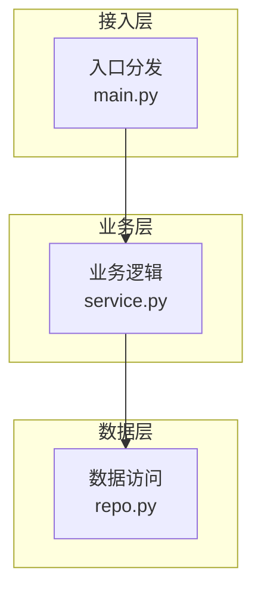
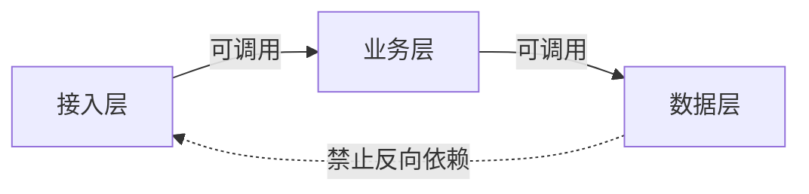
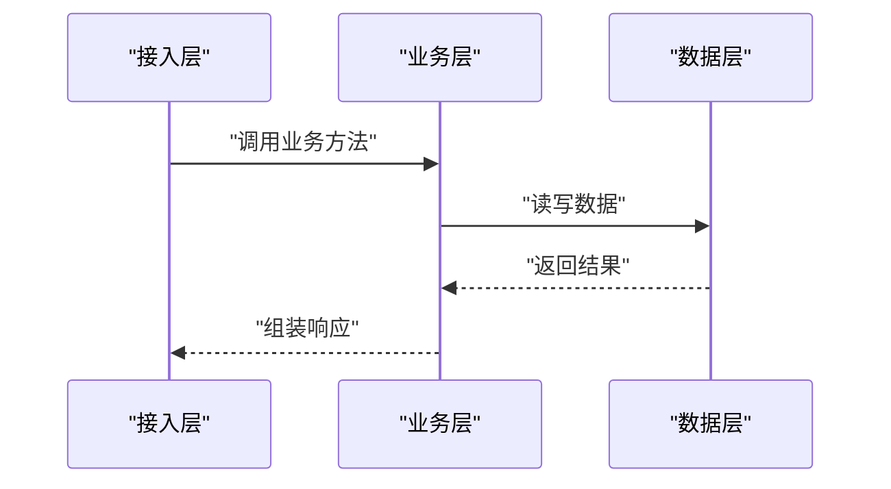

# {{TITLE}}

## 目录
1. [简介](#简介)
2. [分层总览](#分层总览)
3. [各层职责](#各层职责)
4. [层间依赖与调用规则](#层间依赖与调用规则)
5. [纵向切片：一次调用的穿越](#纵向切片一次调用的穿越)
6. [横切关注点](#横切关注点)
7. [故障排查指南](#故障排查指南)
8. [结论](#结论)

## 简介
<一段话：这个分层体系是什么、按什么原则分层、在仓库中的位置。>

## 分层总览
<一段话概括分几层、每层一句话定位。配垂直堆叠的分层图（上层在上，每层列代表组件）。>

图表来源
- [<path>:<起>-<止>](file://<path>#L<起>-L<止>)

章节来源
- [<path>:<起>-<止>](file://<path>#L<起>-L<止>)

## 各层职责
### <层名 1>
- 职责：<这一层做什么>
- 代表模块：<关键文件/类>
- 不该做的事：<越层行为，如绕过业务层直接访问数据层>

章节来源
- [<path>:<起>-<止>](file://<path>#L<起>-L<止>)

### <层名 2>
- ...

章节来源
- [<path>:<起>-<止>](file://<path>#L<起>-L<止>)

## 层间依赖与调用规则
<一段话：允许谁调用谁、禁止什么方向的依赖、违规如何表现。配依赖方向图。>

图表来源
- [<path>:<起>-<止>](file://<path>#L<起>-L<止>)

章节来源
- [<path>:<起>-<止>](file://<path>#L<起>-L<止>)

## 纵向切片：一次调用的穿越
<选一条有代表性的调用路径，用时序图展示它如何从入口层穿越到存储层再返回。>

图表来源
- [<path>:<起>-<止>](file://<path>#L<起>-L<止>)

章节来源
- [<path>:<起>-<止>](file://<path>#L<起>-L<止>)

## 横切关注点
先用一段话概括横切机制的总体落点，再逐条列举：机制 → 出现在哪些层 → 关键代码位置。

章节来源
- [<path>:<起>-<止>](file://<path>#L<起>-L<止>)

## 故障排查指南
- <常见错误/现象 → 原因 → 定位步骤 → 相关代码位置（如疑似越层调用如何排查）。>

章节来源
- [<path>:<起>-<止>](file://<path>#L<起>-L<止>)

## 结论
<一段话总结：分层依据、正确使用方式与注意事项。>

章节来源
- [<path>:<起>-<止>](file://<path>#L<起>-L<止>)

<cite>
**本文引用的文件**
- [<文件名>](file://<仓库相对路径>)
- [<文件名>](file://<仓库相对路径>)
</cite>
