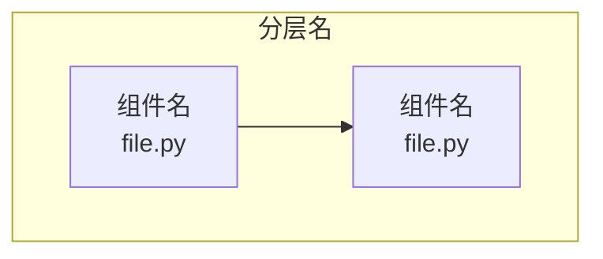
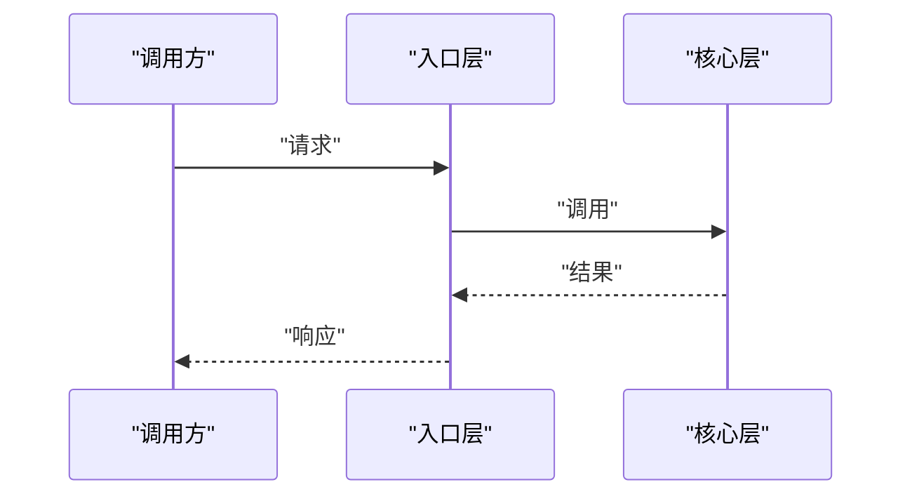

# {{TITLE}}

## 目录
1. [简介](#简介)
2. [项目结构](#项目结构)
3. [核心组件](#核心组件)
4. [架构总览](#架构总览)
5. [详细组件分析](#详细组件分析)
6. [依赖关系分析](#依赖关系分析)
7. [性能与一致性考量](#性能与一致性考量)
8. [故障排查指南](#故障排查指南)
9. [结论](#结论)

## 简介
<一段话概括本页主题：是什么、解决什么问题、在仓库中的位置；可引用 README/官方文档原句佐证定位（file:// 引用），并附 2~4 条关键特征 bullet（语言/规模/形态）。>

## 项目结构
<与本章相关的仓库目录/文件组织说明：先给一段 fenced text（无语言标注代码块）形式的目录树，再用 bullet 说明关键目录职责。>

图表来源
- [<path>:<起>-<止>](file://<path>#L<起>-L<止>)

章节来源
- [<path>:<起>-<止>](file://<path>#L<起>-L<止>)

## 核心组件
<组件 ≥4 个时用表格呈现（| 组件 | 关键文件 | 一句话职责 |），表前一句话说明读法；少量时用 bullet。>
- <组件/概念名>：<一句话职责说明>
- 扩展点：<可定制/插件化的位置；没有则省略此条>

章节来源
- [<path>:<起>-<止>](file://<path>#L<起>-L<止>)

## 架构总览
<一段话 + 时序图，描述本主题的运行时交互或数据流；类型/继承关系是重点时，可在时序图外补一张 classDiagram。>

图表来源
- [<path>:<起>-<止>](file://<path>#L<起>-L<止>)

章节来源
- [<path>:<起>-<止>](file://<path>#L<起>-L<止>)

## 详细组件分析
<索引页（章节首页）在此给出导航表格：| 子页 | 核心实体/机制 | 一句话职责 |（不带链接）；主题页则按子组件逐一展开。>
### <子组件/子主题 1>
- 职责：<...>
- 关键行为：<...>
- 实现要点：<...>
- 配置面：<相关配置项/环境变量；没有则省略此条>

章节来源
- [<path>:<起>-<止>](file://<path>#L<起>-L<止>)

### <子组件/子主题 2>
- ...

**章节来源**
- [<path>:<起>-<止>](file://<path>#L<起>-L<止>)

## 依赖关系分析
- 先用一段话概括整体依赖格局；依赖按 必选/推荐/可选 三档分组，≥4 项时用表格（| 依赖 | 最低版本 | 作用 |）。

图表来源
- [<path>:<起>-<止>](file://<path>#L<起>-L<止>)

章节来源
- [<path>:<起>-<止>](file://<path>#L<起>-L<止>)

## 性能与一致性考量
- 先用一段话概括总体特征与关键取舍，再用 bullet 列举要点（性能/并发/缓存/一致性）。

章节来源
- [<path>:<起>-<止>](file://<path>#L<起>-L<止>)

## 故障排查指南
- 排查思路先用一句散文概括，再逐条列出至少 3 个场景：现象 → 原因 → 定位步骤 → 相关代码位置。

章节来源
- [<path>:<起>-<止>](file://<path>#L<起>-L<止>)

## 结论
<一段话总结：本主题的定位、正确使用方式与注意事项。>

章节来源
- [<path>:<起>-<止>](file://<path>#L<起>-L<止>)

<cite>
**本文引用的文件**
- [<文件名>](file://<仓库相对路径>)
- [<文件名>](file://<仓库相对路径>)
</cite>
